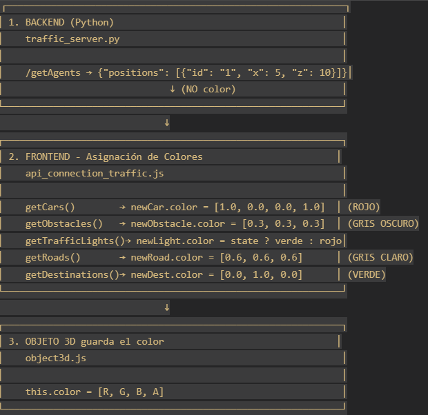
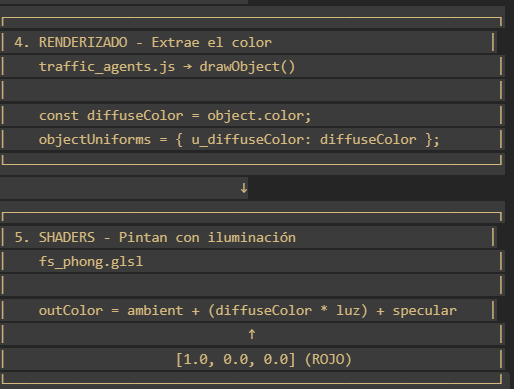

## 1. Back end manda posiciones
archivo> traffic_server.py
```python

{
    positions = [
        {"id": "agent_1", "x": 10, "y": 20}, <-- Sin color
        {"id": "agent_2", "x": 30, "y": 40},
    ]
}
```

## 2. Front asigna colores por tipo
archivo: api_connection_traffic.js
```javascript
// carros - linea 65
async function getCars() {
    // ...
    for (const car of result.positions) {
        const newCar = new Object3D(car.id, [car.x, car.y, car.z]);
        newCar.color = [1.0, 0.0, 0.0, 1.0]; // ← ROJO (R, G, B, Alpha)
        cars.push(newCar);
    }
}
// obstaculos linea 97
async function getObstacles() {
    // ...
    for (const obstacle of result.positions) {
        const newObstacle = new Object3D(obstacle.id, [obstacle.x, obstacle.y, obstacle.z]);
        newObstacle.color = [0.3, 0.3, 0.3, 1.0]; // ← GRIS OSCURO
        obstacles.push(newObstacle);
    }
}
```

## 3. El objeto guarda el color
archivo: object3d.js
```javascript
class Object3D {
    constructor(id, position=[0, 0, 0], rotation=[0, 0, 0], scale=[1, 1, 1], 
                color=[Math.random(), Math.random(), Math.random(), 1.0]) {
        // ...
        this.color = color; // ← Se guarda aquí
    }
}
```
## 4. Se dibuja el objeto con su color
archivo: traffic_agents.js
```javascript
function drawObject(gl, programInfo, object, viewProjectionMatrix, fract) {
    // ...
    
    // Se obtiene el color del objeto
    const diffuseColor = object.diffuseColor || object.color || [0.8, 0.8, 0.8, 1.0];
    
    // Se pasa a los uniforms del shader
    let objectUniforms = {
        // ...
        u_diffuseColor: diffuseColor,  // ← Aquí se envía al shader
        // ...
    };
    
    twgl.setUniforms(programInfo, objectUniforms);
    gl.bindVertexArray(object.vao);
    twgl.drawBufferInfo(gl, object.bufferInfo);
}
```
## 5. Los shaders usan el color
Archivo: vs_phong.glsl (Vertex Shader)
```glsl
// El vertex shader NO toca el color, solo transforma posiciones
```
Archivo: fs_phong.glsl (Fragment Shader)
```glsl
// Model uniforms
uniform vec4 u_diffuseColor;  // ← Recibe el color aquí

void main() {
    // Cálculos de iluminación...
    
    // Usar el color para calcular la luz difusa
    vec4 diffuseColor = u_diffuseColor * u_diffuseLight * diffuse;
    
    // Color final = ambiente + difusa + especular
    outColor = ambientColor + diffuseColor + specularColor;
}
```

---
